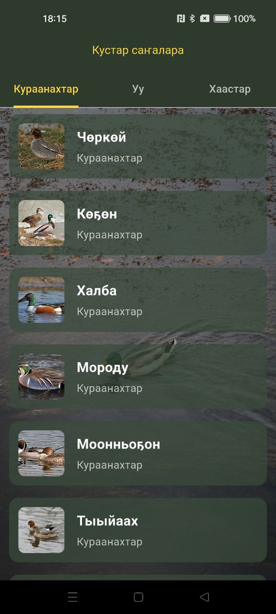
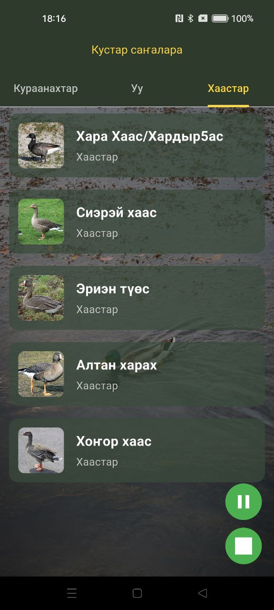
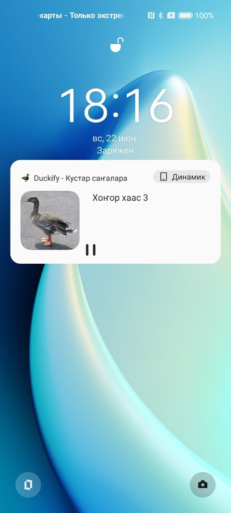
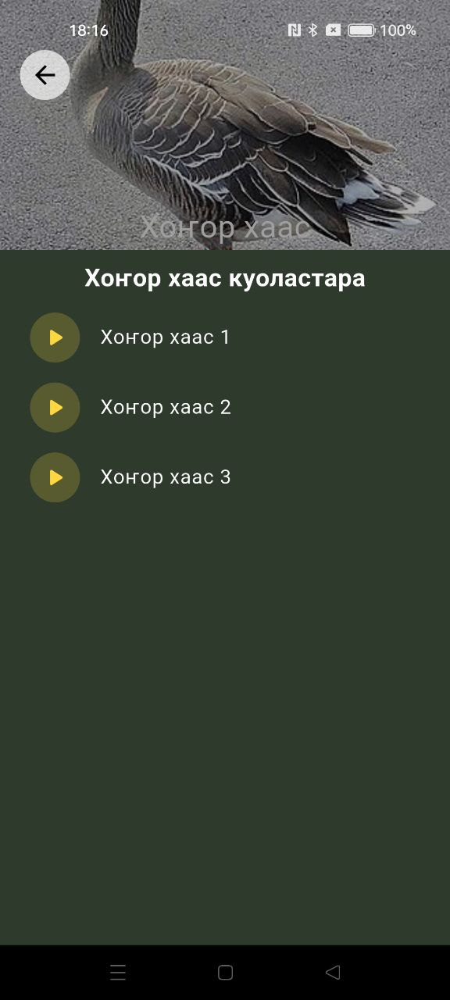

# Duckify - Манок для уток 🦆

Приложение-манок для охоты на уток с коллекцией аудиозаписей птичьих голосов.  
Реализовано на Flutter с использованием BLoC/Cubit для управления состоянием.

## 📱 Основные функции

- Воспроизведение аудиозаписей манков
- Разделение по категориям уток
- Фоновая работа аудио
- Системные медиа-уведомления

## 🏗️ Архитектура
MVC - Model View Controller

## 🛠️ Технологии

- **Аудио**: `just_audio` + `audio_service` для фонового воспроизведения
- **Стейт-менеджмент**: `flutter_bloc` + `cubit`
- **Для файловой системы**: `path_provider`
- **Для сравнения моделей и процедур**: `equatable`
